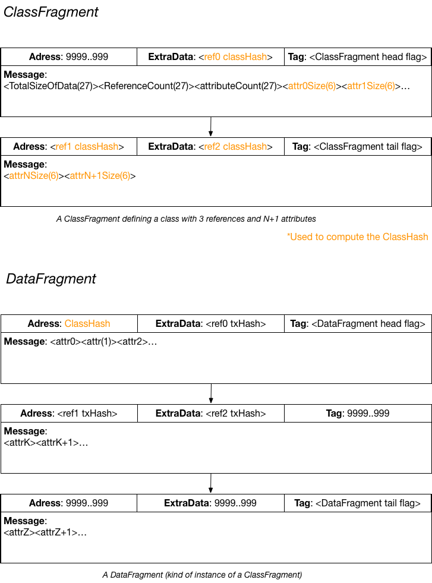

## Serialization.ixi

Serialization.ixi provides a framework to publish data referencing other pieces of data on the Tangle.

To do that we define two types of BundleFragment :

The ClassFragment represent the metadata of a DataFragment. The DataFragment to store the data (as a list of attributes) and the references to other pieces of data.

The attributes of a DataFragment are stored in it's message field. (maybe be on multiple transactions when required).
The references to other DataFragment (or arbitrary transactions) are stored in address and extradata-digest fields of bundleFragment transactions.

### BundleFragment

A bundle fragment is a portion of [standard IOTA bundle](https://docs.iota.org/docs/getting-started/0.1/introduction/what-is-a-bundle). 
Transactions in a bundle fragment are ordered by their trunk transaction (this characteristic is inherited from IOTA bundle). 
Just like IOTA bundles, bundle fragments have a head transaction and a tail transaction (which can be the same transaction 
when the bundle fragment contains only one transaction). 
We set a specific trit in the tag field to 1 to mark the head transaction of a bundle fragment. 
We set another trit of the tag field to 1 to mark the tail transaction of a bundle fragment. 
Those 2 trits must be 0 in all body transactions.

### ClassFragment

We define a ClassFragment as a Bundle fragment using trit at tag[4] set to 1 to indicate the fragment-head-transaction 
and the trit at tag[3] to indicate the fragment-tail-transaction.

The message of ClassFragment encode metadata about a data fragment : 

- trits [0;81[ : data size
- trits [81;162[ : references count
- trits [162;243[ : attributes count

The following trits of the message field encode the sizes of attributes of the DataFragment.
An attribute is a slice of the message of a DataFragment.
The size of an attribute is encoded on 6 trytes.
When the size of the attribute is unknown or variable : the size is encoded as 0 ('999999')

Address field of the head transaction of a ClassFragment is always the NullHash.  
Extradata-digest and address fields of a ClassFragment store the ClassHash of referenced fragments.
A reference to an arbitrary transaction is denoted by the NULL_HASH. This allow the creation of "chain" of DataFragment, but also referencing non DataFragment.

We define the *ClassHash* as the hash (Curl-27) of the concatenation: &lt;referenced ClassHash&gt;&lt;attributes size&gt;

### DataFragment

We define a DataFragment as a Bundle fragment using trit at tag[6] set to 1 to indicate the fragment-head-transaction 
and the trit at tag[5] to indicate the fragment-tail-transaction.

The address field of the headTransaction is reserved to store the ClassHash of the ClassFragment for this DataFragment.
The transaction hash of referenced data-fragment are stored in next extradata-digest and address fields of bundle fragment transactions.

The message field of a DataFragment encode the attributes values. An attribute of variable size is encoded in two 
parts : the 6 first trytes encode the size in trytes, then followed by the data itself.

### API

    // FACTORY
    
    public DataFragment buildDataFragment(DataFragment.Builder builder);
    public ClassFragment buildClassFragment(ClassFragment.Builder builder);
    
    /**
    * Build a DataFragment.Prepared for data.
    * The DataFragment.Prepared can be used later to insert the dataFragment in Bundle.
    *
    * @return a prepared DataFragment.
    */
    public DataFragment.Prepared prepare(DataFragment.Builder builder);
    
    /**
    * Build a ClassFragment.Prepared from builder.
    * The ClassFragment.Prepared can be used later to insert the classFragment in a Bundle.
    *
    * @return a prepared ClassFragment.
    */
    public ClassFragment.Prepared prepareClassFragment(ClassFragment.Builder builder);
    
    public <F extends BundleFragment,T extends BundleFragment.Builder<F>> F publishBundleFragment(T fragmentBuilder);
    
    public <F extends BundleFragment,T extends BundleFragment.Builder<F>> F prepareBundleFragment(T fragmentBuilder);
    
    //SEARCH
    
    /**
    * @param classHash searched classHash
    * @return all DataFragment for a given classHash
    */
    public Set<DataFragment> findDataFragmentForClassHash(String classHash);
    
    /**
    * @param referencedTransactionHash the transaction hash of the dataFragment to be referenced
    * @return all DataFragment referencing *referencedTransactionHash*
    */
    public Set<DataFragment> findDataFragmentReferencing(String referencedTransactionHash, DataFragment.Filter filter);
    
    /**
    * @return the ClassFragment with head transaction identified by transactionHash,
    * or null if the transaction is not the head of a valid ClassFragment.
    * @throws IllegalArgumentException when transactionHash is not a valid transaction hash (81 trytes)
    */
    public ClassFragment loadClassFragment(String transactionHash);
    
    public ClassFragment loadClassFragmentForClassHash(String classHash);
    
    /**
    * @return the DataFragment with head transaction identified by transactionHash,
    * or null if the transaction is not the head of a DataFragment.
    * @throws IllegalArgumentException when transactionHash is not a valid transaction hash (81 trytes)
    */
    public DataFragment loadDataFragment(String transactionHash);
    
    public DataFragment getFragmentAtIndex(DataFragment fragment, int index);
    
    public String getAttribute(DataFragment dataFragment, int attributeIndex);
    
    //EEE
    
    /**
    * Request submission of effect when dataFragment with a particular classHash is received.
    *
    * @param environmentId : environment where effect will be sent
    */
    public void registerDataListener(String classHash, String environmentId);
    
    
    /**
    * Request submission of effect when dataFragment with a particular classHash is received.
    *
    * @param matcher  : a filter for fragment of interest
    * @param environmentId : environment where effect will be sent
    */
    public void registerDataListener(DataFragment.Filter matcher, String environmentId);
    
