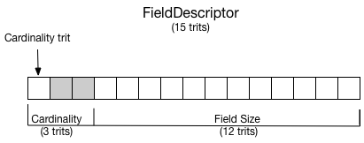

## Serialization.ixi

This document describes in more details the serialization format supported by this ixi.
(a more operational overview is available [here](readme.md))

### BundleFragment

A bundle fragment is a portion of [standard IOTA bundle](https://docs.iota.org/docs/getting-started/0.1/introduction/what-is-a-bundle). 
Transactions in a bundle fragment are ordered by their trunk transaction (this characteristic is inherited from IOTA bundle). 
Just like IOTA bundles, bundle fragments have a head transaction and a tail transaction (which can be the same transaction when the bundle fragment contains only one transaction). 
We set a specific trit in the tag field to 1 to mark the head transaction of a bundle fragment. 
We set another trit of the tag field to 1 to mark the tail transaction of a bundle fragment. Those 2 trits must be 0 in all body transactions.

We define the **BundleFragmentHash** as the hash (curl, 27 round) of the concatenation of all signature_or_message_fragment field (ordered from head to tail).

### MetadataFragment

A MetadataFragment is a BundleFragment using trit at tag[4] set to 1 to indicate the fragment-head-transaction and 
the trit at tag[3] to indicate the fragment-tail-transaction. 

The 9 first trits of the signatureMessageFragment of the head-transaction are reserved to encode the version of the encoding. Currently, only one version exists, so the 9 first trits are A99.

The remaining of the signatureMessageFragment of a MetadataFragment contains a non-empty sequence of *field descriptor*.

A *field descriptor* is composed of 3 components of fixed size:

- The <u>type</u> component (6 trits) indicates the cardinality and optionally the way to interpret the value  
    - the first trit is called the cardinality trit. 
        - A cardinality trit 1 indicates that the field is a "single value" 
        - A cardinality trit -1 indicates that the field is a "multiple value" 
        - A cardinality trit 0 is illegal 
    - the 5 following trits indicates how to interpret the (mutiple-)value(s).
        - 0,0,0,0,0 indicates an unspecified field (i.e. just 'trits')
        - 1,0,0,0,0 denotes an Integer 
        - 0,1,0,0,0 denotes an Boolean 
        - 0,0,1,0,0 denotes an Float 
        - 0,0,0,1,0 denotes a TransactionHash 
        - 0,0,0,0,1 denotes an encode ascii value 
        - (other trit sequences are 'reserved' for future use)
- The <u>size</u> component (12 trits) indicates either :
    - the size of the field in trits (when cardinality is "single value")
    - the size of one element of the list (when cardinality is "multiple values")
    Note that a Boolean field should have a size of 1 and a TransactionHash field should have a size of 243.
- The <u>label</u> component (144 trits) is a human readable description  (up 24 chars, ascii encoded) of the field.

Decimal type: a decimal number is composed of two part, the mantissa and the exponent. 
If the length of the decimal field is N, the exponent is encoded in the last N/3 trits, 
the other (N-N/3) first trits encode the mantissa.

If required, the sequence of field descriptor can be encoded in multiple transactions.

Order of field descriptor define the order of the field values that will be found in the structured data fragment.

The BundleFragmentHash of a Metadata fragment is called the **ClassHash**.

> A MetadataFragment don't necessarily need to be published on the tangle. The publisher and subscriber(s) may just have 
a static knowledge of the class being serialized (i.e. FieldDescriptors sequence) to be able to successfully 
publish/receive structured data. 

### StructuredDataFragment

A StructuredDataFragment is a BundleFragment using trit at tag[6] set to 1 to indicate the fragment-head-transaction 
and the trit at tag[5] to indicate the fragment-tail-transaction. 

Extra-data digest field of each transaction in a StructuredDataFragment contains the 
ClassHash of the corresponding MetadataFragment.

The signature_or_message fragment contains the data. Values are of course ordered and sized 
according field descriptor sequence of the MetadataFragment.

When the value is the content of a multiple value field : the 12 first trits of the field indicate the number items 
in the list. (a list can contains up to 260720 items)

<small>*Metadata and StructuredData are represented in 2 different bundles here, but they could be in the same bundle.*</small>
